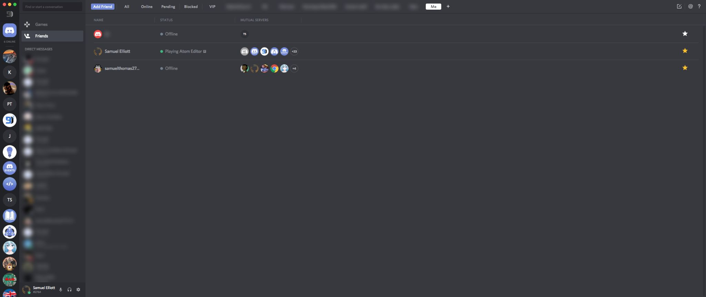
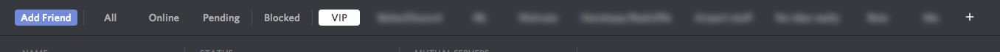
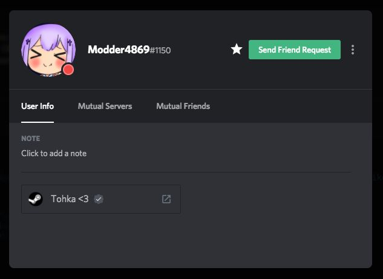
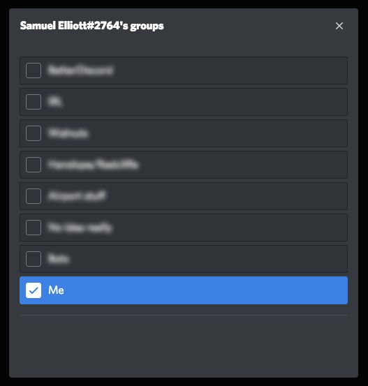

VIPs
===

Adds an extra section to the friends list where you can add your most important contacts on Discord (Bots included). Add users by right clicking their name, opening their profile and then clicking on the star.

Differences from the original
---

https://github.com/Curtis-D/VIPs

- Supports BetterDiscord v2 instead of v1
    - Uses APIs built into BDv2 instead of external libraries
    - Uses the star icon from BDv2
    - Patches all components instead of using observers
- Supports creating additional groups
    - Add users to other groups by right clicking the VIP icon
    - The VIP group cannot be deleted
- Has an API for other plugins to use
    ```js
    // Get the user's groups
    const vips = await bridge('vips');
    const userGroups = vips.getUserGroups(user_id);

    for (let group of userGroups) {
        // Display this somewhere
        retVal.props.children.push(VueInjector.createReactElement(VIPGroupRow, {
            group
        }));
    }
    ```
- Does not have an option to pin the direct message channels of VIPs to the top of the DM channel list
    - [I probably won't add support for this as there is another plugin that does this already](https://github.com/mwittrien/BetterDiscordAddons/tree/master/PluginsV2/PinDMs)

Screen shots
---








